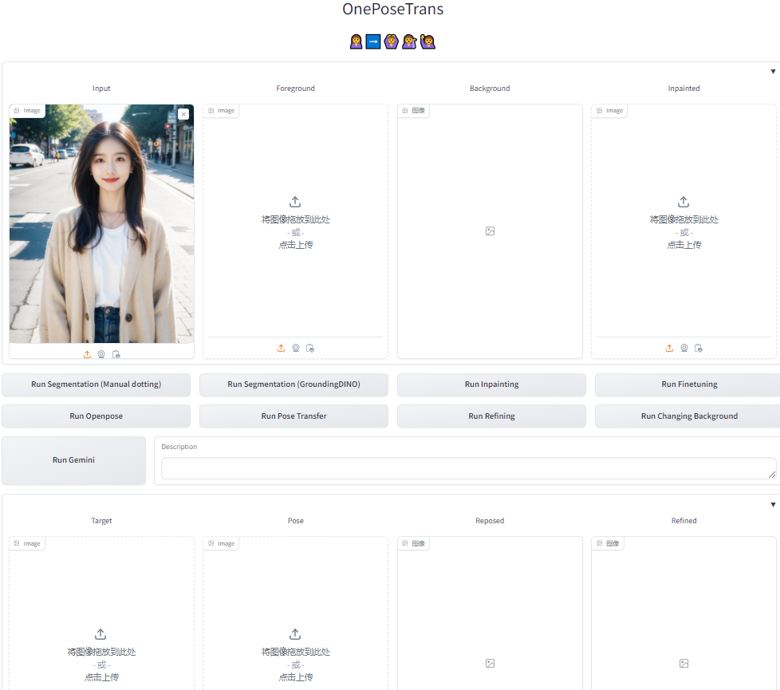
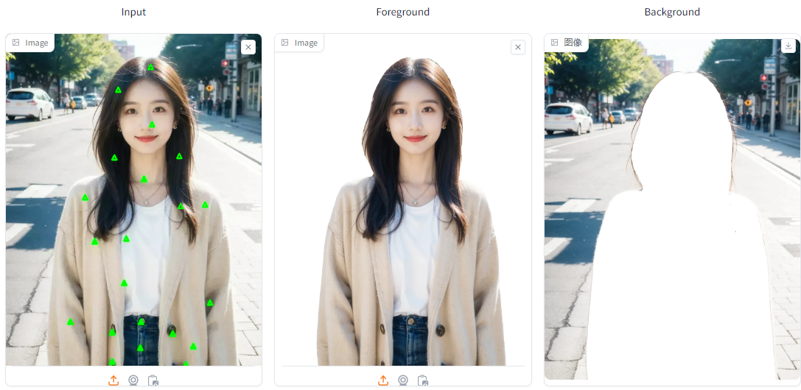
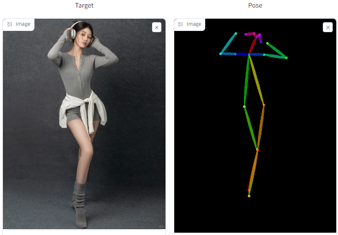
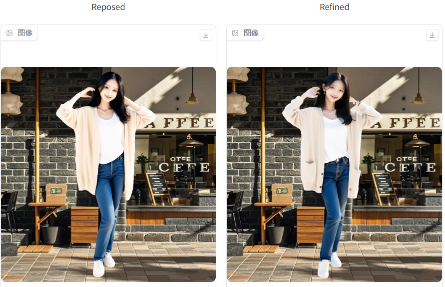
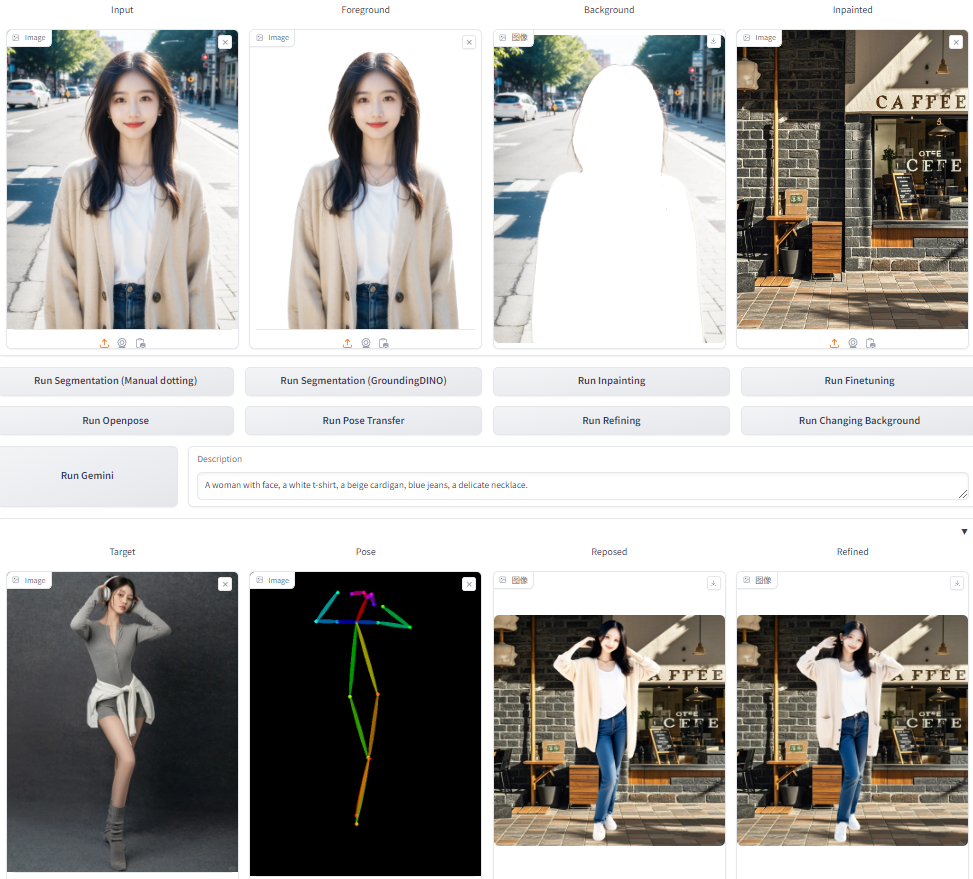

# OnePoseTrans: One-Shot Learning for Pose-Guided Person Image Synthesis in the Wild 🙎➡️🙆💁‍♀️🙋

<p align="center">Dongqi Fan&nbsp;&nbsp;&nbsp;Tao Chen&nbsp;&nbsp;&nbsp;Mingjie Wang&nbsp;&nbsp;&nbsp;Rui Ma&nbsp;&nbsp;&nbsp;Qiang Tang</p>
<p align="center">Zili Yi&nbsp;&nbsp;&nbsp;Qian Wang&nbsp;&nbsp;&nbsp;Liang Chang</p>


Paper Link: https://arxiv.org/abs/2409.09593

# Abstract

Current Pose-Guided Person Image Synthesis (PGPIS) methods depend heavily on large amounts of labeled triplet data to train the generator in a supervised manner. However, they often falter when applied to in-the-wild samples, primarily due to the distribution gap between the training datasets and real-world test samples. While some researchers aim to enhance model generalizability through sophisticated training procedures, advanced architectures, or by creating more diverse datasets, we adopt the test-time fine-tuning paradigm to customize a pre-trained Text2Image model. However, naively applying test-time tuning results in inconsistencies in facial identities and appearance attributes. To address this, we introduce a Visual Consistency Module, which enhances appearance consistency by combining the face, text, and image embedding. Our approach, named OnePoseTrans, requires only a single source image to generate high-quality pose transfer results, offering greater stability than state-of-the-art data-driven methods. For each test case, OnePoseTrans customizes a model in around 48 seconds with an NVIDIA V100 GPU.

# Environment

```
conda create -n oneposetrans python=3.10
conda activate oneposetrans
pip install torch torchvision --index-url https://download.pytorch.org/whl/cu121
pip install -r requirements.txt
```

# Download

Download the following model to the *./models*

```
1.Base SDXL model
https://huggingface.co/SG161222/RealVisXL_V4.0

2.Segment-Anything (vit_h)
https://github.com/facebookresearch/segment-anything

3.GroundingDINO
https://github.com/IDEA-Research/GroundingDINO

4.LaMa-ONNX
https://pan.baidu.com/s/1eDexcJvQurujZZ98ntkWQg?pwd=7hsh  CODE:7hsh

5.Diffusion-inpainting (Optional)
https://huggingface.co/diffusers/stable-diffusion-xl-1.0-inpainting-0.1

6.IP-Adapter
https://huggingface.co/h94/IP-Adapter

7.InstantID
https://huggingface.co/InstantX/InstantID

8.LayerDiffuse
https://huggingface.co/lllyasviel/LayerDiffuse_Diffusers

9.ControlNet
https://huggingface.co/xinsir/controlnet-openpose-sdxl-1.0

10.Antelopev2
https://github.com/deepinsight/insightface/issues/1896#issuecomment-1023867304
```

Make sure the tree of *./models* directory is as follows

```
./models/
├── RealVisXL_V4.0
├── sam_vit_h_4b8939.pth
├── groundingdino_swint_ogc.pth
├── lama_fp32_1024.onnx
├── stable-diffusion-xl-1.0-inpainting-0.1
├── IP-Adapter
		├── image_encoder
		└── sdxl_models
├── InstantID
	    └── ip-adapter.bin
├── LayerDiffuse
		├── ld_diffusers_sdxl_attn.safetensors
		├── ld_diffusers_sdxl_vae_transparent_decoder.safe
		└── ld_diffusers_sdxl_vae_transparent_encoder.safe
└── antelopev2
		├── 1k3d68.onnx
		├── 2d106det.onnx
		├── genderage.onnx
		├── glintr100.onnx
		└── scrfd_10g_bnkps.onnx
```

If you want to verify OnePoseTrans on the dataset, download the DeepFashion and WPose datasets, **otherwise, you don't need to do this step.** Here, we also uploaded OnePoseTrans's results of these two datasets to:  https://pan.baidu.com/s/1eDexcJvQurujZZ98ntkWQg?pwd=7hsh  CODE:7hsh

**DeepFashion**

```
1.Download and unzip  to </your/path/to/fashion>
https://drive.google.com/drive/folders/0B7EVK8r0v71pYkd5TzBiclMzR00?resourcekey=0-fsjVShvqXP2517KnwaZ0zw

2.Download <train/test pairs> and <keypoints> to </your/path/to/fashion>
https://drive.google.com/drive/folders/1qZDod3QDD7PaBxnNyHCuLBR7ftTSkSE1?usp=sharing

3.run <generate_fashion_datasets.py> to split train and test datasets
```

Acknowledge: <train/test pairs> and \<keypoints\> is from [DPTN](https://github.com/PangzeCheung/Dual-task-Pose-Transformer-Network) and <generate_fashion_datasets.py> is borrowed from [CFLD](https://github.com/YanzuoLu/CFLD).

**WPose**

```
Due to responsibility, please download it yourself from https://github.com/adobe-research/UniHuman
```

## Tips

Before running OnePoseTrans in the wild, here are a few tips to generate as satisfactory a result as possible:

1. Try to use high-quality images, such as images in WPose.
2. Ensure your source image provides ample visual information about the person, especially when aiming for full-body pose transfer. For example, using a simple ID photo as the source for a full-body pose (including hands and feet) will likely lead to poor results. 
3. Avoid overly complex pose images.

## Gradio Demo

Step 1. Run demo.py and up load a input image.



Step 2. Run Segmentation: manual dotting (fast) or groundingDINO (slow but better).  **Note that even small variations in foreground segmentation can lead to substantial differences in the final output.** While we offer two segmentation methods, our experiments indicate that the online demo of [Segment Anything](https://segment-anything.com/demo) consistently yields the most favorable results. 



Step 3. Run Gemini to generate description (need API key). Or you can directly input the description.

Step 4. Run Finetuning.

Step 5. Upload a pose image. Or upload the original image and click the Run Openpose to create a pose image.



Step 6. Run Pose Transfer, and you can further Run Refining (Optional). These processes are slow because they include Segmentation (GroundingDINO).

Step 7. Run Inpainting to generate a background, or you can upload one.

Step 8. Run Changing Background.



Overview:



## Running on Datasets

Create the tree of results directory as follows

```
/your/path/to/save/results
├── images       // source deepfashion or wpose test images 
├── images_rgba
├── images_mask
├── images_inpainted
├── lora 		// lora path 
├── reposed_result
├── reposed_rgba
├── reposed_mask
├── reposed_rgb
├── reposed_final_result
├── refined_result
├── refined_rgb
└── refined_final_result
```

Step 1. Segment out the foreground and background

```
python tool_utils 
--mode dataset 
--source_path /path/to/images 
--mask_path /path/to/images_mask 
--rgba_path /path/to/images_rgba
```

Step 2. Generate descriptions, deepfashion or wpose (Or just use what we provided)

```
cd MLLM
python description_gen.py
```

Step 3. Fine-tuning, deepfashion or wpose

```
python lora_deepfashion.py
python lora_wpose.py
```

Step 4. Inpainting, lama (better) or diffusion

```
python tool_utils 
--mode inpainting_lama 
--source_path /path/to/images 
--mask_path /path/to/images_mask 
--background_path /path/to/images_inpainted

python tool_utils 
--mode inpainting_diffusion 
--source_path /path/to/images 
--mask_path /path/to/images_mask 
--background_path /path/to/images_inpainted
```

Step 5. Run *oneposetrans_deepfashion.py* or *oneposetrans_wpose.py*

```
python oneposetrans_deepfashion.py
python oneposetrans_wpose.py
```

Step 6. (optional, for refining stage) Segment out the foreground from the reposed result, rgba

```
python tool_utils 
--mode rgba 
--source_path /path/to/reposed_result
--rgba_path /path/to/reposed_rgba 
```

Step 7. Segment out the foreground from the reposed result, rgb

```
python tool_utils 
--mode rgb 
--source_path /path/to/reposed_result
--rgb_path /path/to/reposed_rgb
--mask_path /path/to/reposed_mask
```

Step 8. Attach the foreground to the background

```
python tool_utils 
--mode paste 
--rgb_path /path/to/reposed_rgb 
--mask_path /path/to/reposed_mask
--background_path /path/to/images_inpainted
--result_path /path/to/reposed_final_result
```

Step 9. Refining. Run *refining_stage_deepfashion*.py or *refining_stage_wpose.py*.

```
python refining_stage_deepfashion.py
python refining_stage_wpose.py
```

Step 10. Segment out the foreground from the reposed result, rgb

```
python tool_utils 
--mode rgb 
--source_path /path/to/refined_result
--rgb_path /path/to/refined_rgb
--mask_path /path/to/refined_mask
```

Step 11. Attach the foreground to the background

```
python tool_utils 
--mode paste 
--rgb_path /path/to/refined_rgb 
--mask_path /path/to/refined_mask
--background_path /path/to/images_inpainted
--result_path /path/to/refined_final_result
```

## Acknowledge
Our implementation of **pipeline_stable_diffusion_xl_oneposetrans.py** builds upon the [InstantID](https://github.com/instantX-research/InstantID) pipeline, while **lora_deepfashion.py and lora_wpose.py** are developed based on [FreeDrag's](https://github.com/LPengYang/FreeDrag) **train_dreambooth_lora.py**. We extend our gratitude to the creators and contributors of these projects for their valuable work.

## Cite
If you find OnePoseTrans and our project useful, please cite our paper:
```bibtex
@article{fan2024one,
  title={One-Shot Learning for Pose-Guided Person Image Synthesis in the Wild},
  author={Fan, Dongqi and Chen, Tao and Wang, Mingjie and Ma, Rui and Tang, Qiang and Yi, Zili and Wang, Qian and Chang, Liang},
  journal={arXiv preprint arXiv:2409.09593},
  year={2024}
}
```

If you have any questions please contact: dongqifan@std.uestc.edu.cn
